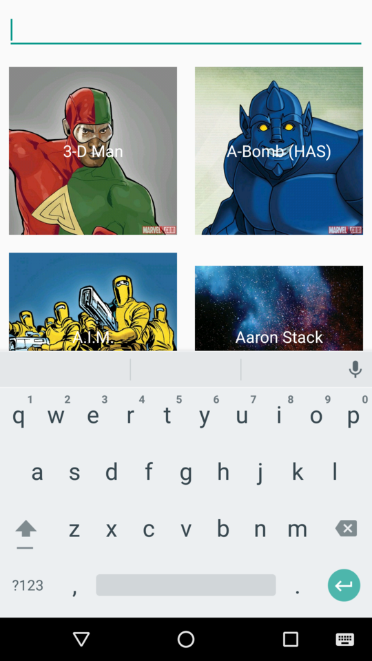
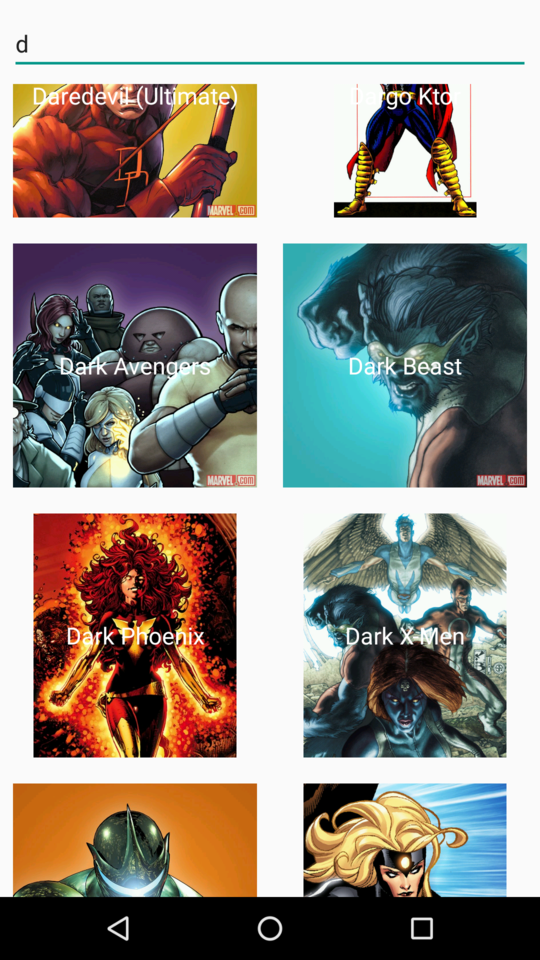
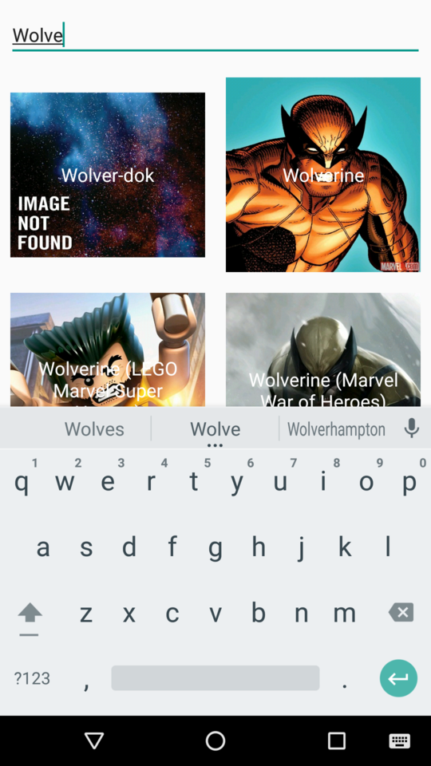
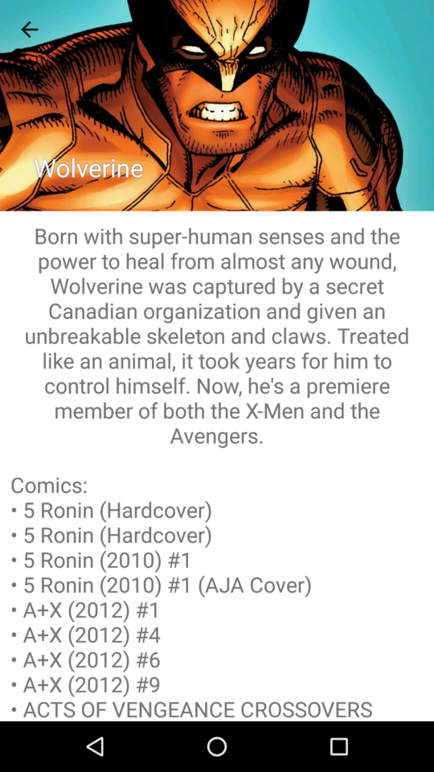

# Marvel Gallery

Simple application, that is showing how Kotlin can be used to make Android development simpler and easier.
Application is intentionally not using Dagger and only basic functionalities of RxJava, to keep this example simple and understandable to more programmers.

Uses Marvel Comics API as a service which contains all the information about its vast library. Data provided by Marvel.

# Usage

In application there is characters gallery, based on RecyclerView, and search bar that is allowing to type filter for presented characters.

When we click to character icon, then his profile is displayed. It contains its name, description and his occurrences in comics, series, stories and events.

# Development

To start an application you need to go to [Marvel Developer Portal](https://developer.marvel.com/), make account ad get private and public key. Then you need to replace REPLEACE_WITH_YOUR_PUBLIC_MARVEL_KEY and REPLEACE_WITH_YOUR_PRIVATE_MARVEL_KEY in gradle.properties with your keys. It is enough to start and test application on AndroidStudio. 